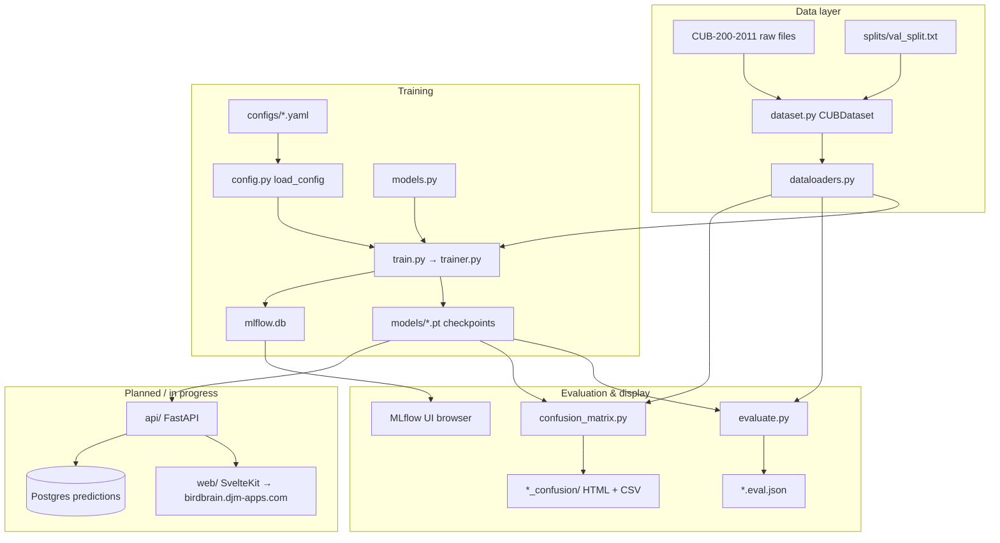

# Overview

Birdbrain is a fine-grained bird species classifier for the [CUB-200-2011](https://www.vision.caltech.edu/datasets/cub_200_2011/) dataset (200 species). It uses transfer learning with ImageNet-pretrained backbones, staged fine-tuning driven by YAML configs, and local MLflow experiment tracking.

## End-to-end flow



## Design principles

1. **YAML-driven stages** — Each training stage is a config file; no hyperparameters hardcoded in Python.
2. **Proper split discipline** — Official CUB test is never used during training. A 10% holdout from official train drives early stopping and checkpoint selection.
3. **Checkpoint chaining** — Stage *N* loads stage *N−1* weights; metadata travels with the `.pt` file for inference.
4. **One-off test eval** — Final metrics on the official test set run once via `evaluate.py`, not every epoch.
5. **Separate analysis tools** — Confusion matrix and per-class reports are standalone scripts, not embedded in the training loop.

## Repository layout

```
birdbrain/
├── configs/              # One YAML per model/stage
├── splits/               # val_split.txt (committed)
├── scripts/              # create_val_split.py
├── data/raw/CUB_200_2011/  # Dataset (gitignored)
├── training/             # All Python training/eval code
├── models/               # Checkpoints, labels.json, analysis output (gitignored)
├── mlflow.db             # Experiment tracking DB (gitignored)
├── mlartifacts/          # MLflow artifact store (gitignored)
├── docs/                 # This documentation
├── web/                  # SvelteKit frontend (Identify, About, Docs, Citation)
├── api/                  # Planned FastAPI inference service
└── db/schema.sql         # Planned Postgres schema for production predictions
```

## Supported models

| Key | Architecture | Head | Stages |
|-----|--------------|------|--------|
| `efficientnet_b0` | EfficientNet-B0 | `classifier[1]` | 5 YAML configs |
| `resnet50` | ResNet50 | `fc` | 5 YAML configs |

Both use the same five-stage progression: head-only → progressive unfreezing → bbox crop + strong augmentation.

## Device selection

`trainer.py` and eval scripts pick device automatically:

1. CUDA (NVIDIA GPU)
2. MPS (Apple Silicon)
3. CPU

## What is not built yet

- FastAPI inference service (`api/` — README only)
- Wiring upload UI to live predictions (frontend exists in `web/`)
- Postgres prediction logging (schema stub exists in `db/schema.sql`)
- MLflow Model Registry / production deployment hooks
